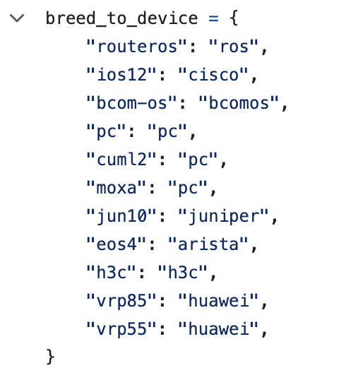

# Как подружить вашего вендора и Annet/Gnetcli/Gnetcli_adapter

## Annet

[Проект](https://github.com/annetutil/annet)

Для того чтобы обеспечить минимально необхоидимый минимум добавления нового вендора в Annet, нужно вкратце:
- Описать маппинг вендора и модели получаемых из NetBox, а так же получаемого модельного ряда в объекты ```NetboxDevice``` и ```HardwareView```.
- Описать в руллбуках нового вендора, определить дефолтные функции для обработки патча/дифа.
- Описать непосредственно генераторы
- Написать базовые тесты

#### vendor & models

1) ```annet/adapters/netbox/common/manufacturer.py```

Добавляем в **is_supported** и **get_breed** функции новый breed (общий идентификатор для типа устройства, тут может быть версия ОС, к примеру Huawei имеет модельный ряд CE c VRP 8 а Quidway с VRP 5).
Этот breed будет в качестве параметра экземпляра класса model.NetboxDevice, общего класса для Netbox стораджа.


2) ```annet/annlib/netdev/devdb/data/devdb.json```

Добавляем маппинг названия вендорских моделей из NetBox (device types) в объект класса ```HardwareView``` для того чтобы мы могли валидировать модель устройства внтури генератора, обращаясь к device.hw.


3) ```annet/annlib/netdev/views/hardware.py```

Добавляем нашего вендора в функции hw_to_vendor и vendor_to_hw, для того чтобы Annet мог преобразовывать нашего нового вендора в объект класса ```HardwareView``` с которым работает Annet


#### Rulebooks

4) ```annet/annlib/rbparser/platform.py```

Тут мы добавляем нашего нового вендора в rulebook parser, где в файле platform располагаются словари с существующими платформами определяющие дефолтное поведение при построении дифа, команды ответственные за удаление конфигурации и команды выхода и существующего блока конфигурации.


5) ```annet/rulebook/common.py```

Тут мы должны описать - те команды, которые должны быть безусловно выполнены до / после деплоя конфигурации, например войти в режим конфигурации, а по завершению - ввести exit, закоммитить (если устройство поддерживает коммиты) и в конце, например, сохранить конфигурацию. 
Тут мы работаем с объектом ```HardwareView```, соответственно можем для разных моделей по-разному определять поведение:


6) ```annet/rulebook/tabparser.py```

Тут мы описываем логику формирования отступов для B4COM по аналогии с существующими вендорами для вложенных блоков.

 


7) ```annet/tabparser.py```

Так же добавляем сюда наш новый парсер в функцию make_formatter:


8) ```annet/rulebook/<vendor>```

Содержит папки с вендорами и различными файликами для описания кастомных функций, которые потом определяют обработку правил для генерации, дифа и выкатки конфигов. 
Состоит из трех важных частей: 
- **b4com.rul** - правила формирования дифа и патча
- **b4com.order** - порядок генерации команд, которые будут переданы на оборудование
- **b4com.deploy** - действия Annet в момент самой выкатки (например корректно отвечать на интерактивные вопросы)

Руллбуки по сути отвечают на вопрос как мы формируем дифф и патч, в каком порядке, как обрабатываем интерактивные вопросы от оборудования в процессе его конфигурации. Руллбуки - второй по частоте изменяемости после генераторов участок кода Annet (особенно rul), которые позволяют определеить корректность генерации дифа и патча для устройства. Добавляем первоначальные конфиги, которые позволят нам уже начать писать первые генераторы. Если строчка конфигурации не добавлена в  rul, то к ней будет применено правило по-умолчанию, определенное для вендора в ```annet/annlib/rbparser/platform.py```


#### Generators

9) ```annet/generators/example/lldp.py```

Добавляем к существующим примерам генераторов,пример для генерации конфигурации для вашего нового-кленового вендора, я выбрал LLDP.
Обратите внимание что мы определяем для нашего вендора ACL ```acl_b4com```, где определяем для каких строчек конфигурации в конфигурации будет сгененирован конфиг LLDP
И непосредственно функцию для генерации ```run_b4com```.


#### Tests

Ну и куда без тестов. От их покрытия зависит качество контроля за будущей разработкой и поддержки нового вендора. Но на базовом уровне, достаточно добавить тест на генерацию патча, чтобы понимать что написанный нами генератор и описанные руллбуки генерируют все корректно. (Напомню, для вызова тестов в корне проекта можно воспользоваться командой: ```tox -e ci```)

10) ```tests/annet/__init__.py```

В ```__init__``` файле модуля tests есть функция **make_hw_stub**, которая возвращает объект ```HardwareView``` для эмуляции работы с объектом device. Тут мы должны в нее так же добавить нашего вендора, как мы это делали в ```annet/adapters/netbox/common/manufacturer.py```


11) ```tests/annet/test_patch/b4com_lldp.yaml```

К счастью, написана очень удобная автоматика, позволяющая добавить текст для валиадции патча посредством yaml файла:


## Gnetcli

[Проект](https://github.com/annetutil/gnetcli)

Помимо Annet нам необходимо добавить поддержку нашего нового вендора Gnetcli - транспорте, который вызывает Annet.

1) ```pkg/devconf/devconf.go```

В ```InitDefaultDeviceMapping``` добавляем нового вендора, который по переданному клиентом значению device, к примеру ```"host_params": {"device": "bcomos"}``` мапит ```GenericCLIWrapper``` с аргументом функции ```NewDevice``` из пакета ```bcomos```, который мы определим чуть ниже:


2) ```pkg/device/bcomos/bcomos.go```

Тут мы определяем регулярки для определения различного вида prompt: операционного/конфигурационного, интерактивных вопросов, какие prompt мы считаем ошибочными и какие prompt считать паджинацией. В качестве рефереренса брал Cisco, т.к. CLI очень похож (не совсем, как потом показала практика):


3) ```pkg/device/bcomos/test_bcomos.go```

Ну и куда без тестов: определяем список ошибочных промптом, и смотрим что errorExpression матчит их по регуляркам. Тоже самое делаем с обычным prompt:


Ну и проверяем что все ок:
```
go test pkg/device/bcomos/bcomos.go pkg/device/bcomos/bcomos_test.go
ok  	command-line-arguments	0.346s
```

Далее запускаем сервер 

```./server -debug -basic-auth $GNUSER:$GNPASS -dev-login $SWUSER -dev-pass $SWPASS```

И проверяем любым доступным способом, например через grpcurl:

```
grpcurl -H "Authorization: Basic $(echo -n "$GNUSER:$GNPASS" | base64)" -plaintext -d '{"host": "grb-omlf01.n.mws-infra.net", "cmd": "show clock", "string_result": true, "host_params": {"device": "bcomos"}}' localhost:50051 gnetcli.Gnetcli.Exec
```
К слову, новое оборудование можно тестировать и "на лету", подробнее [тут](https://annetutil.github.io/gnetcli/new_device/)

## Gnetcli adapter

[Проект](https://github.com/annetutil/gnetcli_adapter/)

Является реализацией "мостика" связывающего Annet и Gnetcli, задача которого, подготовить и отправить задачу посредством Python GRPC клиента в сторону Gnetcli сервера

1) ```src/gnetcli_adapter/gnecli_adapter.py```

Тут необходимо указать маппинг конкретного breed в Annet с конретным типом device внутри Gnetcli. А так же описать вызов, которым фетчер опрашивает конфигурацию оборудования:


